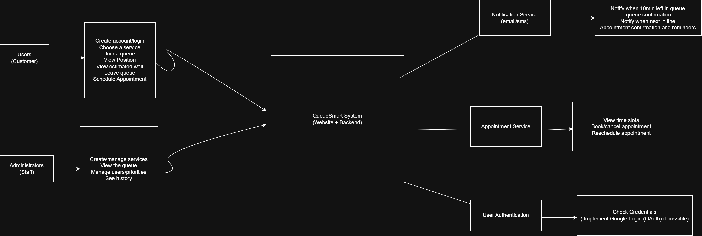

# QueueSmart

## System Context Diagram

- Users and Administrators interact with the QueueSmart website
- Users are able to create accounts, join/leave queues, view position and estimated wait time, and schedule appointments
- Admins are able to create/manage services and handle user priorities
- No internal implementation details of QueueSmart are shown
- Notifications are handled via email/SMS to deliver updates on queues and appointments
- The Appointment Service handles booking, cancellation, and rescheduling requests
- QueueSmart uses user credentials for authentication
